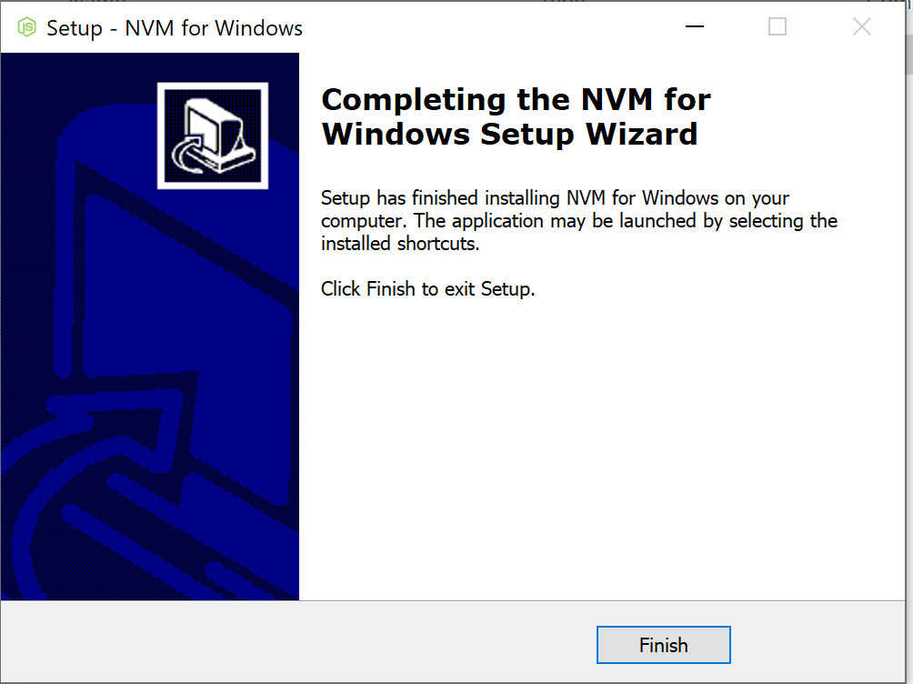
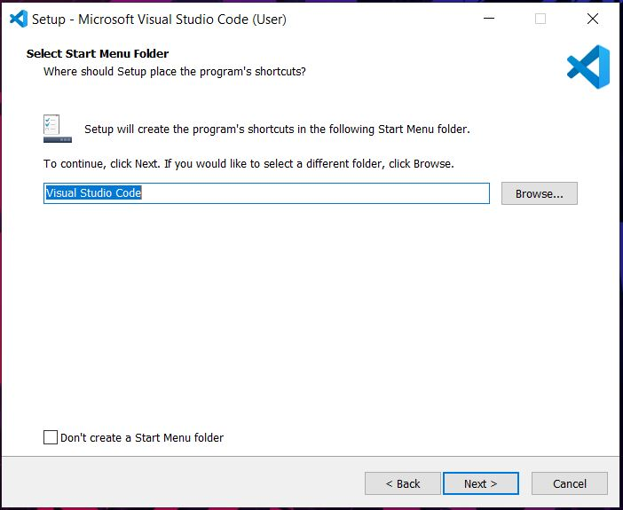

This tutorial describes the basic steps needed to set up a development environment with NodeJS, TypeScript, and VisualStudio Code.
At the end of this tutorial, you should have a complete local development environment that you can use to build and test
code for this class.

Contents:

- [Installing NodeJS](#installing-nodejs)
- [Installing Visual Studio Code](#installing-visual-studio-code-vscode)
- [Hello, World in TypeScript](#getting-started-with-typescript)

If you run into any difficulties following any of these steps, please post (in a non-private question) on Piazza.

# Installing NodeJS

Node.js is a JavaScript runtime built on Chrome's V8 JavaScript engine.

**For this class, you will need Node.js version 22 (22.18.0 was the latest version at time of writing, although any 22.x should work in theory).**

There are many ways that you can install Node.js: for instance, you can use a package manager like
`snap` or `homebrew` to install it; you can download an installer directly from the Node.js website, and you can,
of course, build it from source. However, due to the complexity of running different Node.js versions on the same machine, we _very strongly_ suggest using `nvm`, as explained below.

We recommend installing Node.js using [nvm, the node version manager](https://github.com/nvm-sh/nvm). When language runtimes
are in active development (like Node.js is), sometimes you end up needing to have multiple versions of Node.js installed,
and different projects that you work on might require different versions of Node.js. These annoyances are quite rare,
but when it happens that you need to have mutliple versions of Node.js installed, it's super handy to have your system set up already
so that installing multiple versions and switching between it is easy. You can use our instructions to set up nvm even if you
have previously installed Node.js.

## Installing NodeJS with NVM for Windows

Before starting the installation, make sure to kill your Visual Studio Code if you have it installed. To do that on Windows, open a command prompt(type `cmd` in the windows start bar, then select "Run as administrator") and run the command `taskkill.exe /IM code.exe`.

1. Download `nvm-setup.exe` from the most recent release of [nvm-windows](https://github.com/coreybutler/nvm-windows/releases) (at time of writing this document, version was 1.2.2).

   - 

2. Run the executable `nvm-setup.exe`.
   - This should open the nvm installation wizard.
3. Accept the license agreement and click next. Continue to accept the default choices for any remaining prompts, and click "install". If you receive messages along the lines of "NodeJS version XYZ is already installed, would you like nvm to control this installation," select "Yes".
4. Upon completion, you will see the below window
   - 
5. Open a command prompt with administrative privileges (type `cmd` in the windows start bar, then select "Run as administrator").
6. Verify the installation, run the command `nvm version`
   - This should display the version of nvm installed.
   - 
7. Install Node.js version 22 using the command `nvm install 22`.
8. To use this version of NodeJS, run the command `nvm use 22`.

   - The output will look like:

     `Now using node v22.18.0 (npm v10.9.3)`

<!-- Removed step 10 because it overlaps with Verification -->

_Troubleshooting with VSCode_: Did you follow these instructions successfully, but find a "Command not found" error when you try to run `npm` in VSCode? Try this: Close VSCode completely. Re-open it. In your command shell in VSCode, try again. We have noticed that if you have VSCode open while installing `nvm`, it is possible that VSCode will not see the new software installation until it's closed and re-opened. You can also confirm that VSCode correctly sees the NodeJS installation by running `echo %PATH%` in your windows command shell in VSCode: it should include an entry similar to `C:\Program Files\nodejs`.

## Installation Steps (Linux / Mac)

1. Run either `curl -o- https://raw.githubusercontent.com/nvm-sh/nvm/v0.40.1/install.sh | bash` or If `wget` is installed then run `wget -qO- https://raw.githubusercontent.com/nvm-sh/nvm/v0.40.1/install.sh | bash`.
   - For more details, refer to the [NVM GitHub](https://github.com/nvm-sh/nvm?tab=readme-ov-file#installing-and-updating).
2. Close and reopen the active terminal.
   > Note: You can also restart your terminal by running `source ~/.bashrc` or `source ~/.zshrc` depending on your shell.
3. Verify nvm is working by entering `command -v nvm`. If your terminal prints
   out `nvm`, it should be working. If you see `nvm: command not found` or no
   feedback, open a new terminal and trying again or restart from step 1.
4. Install the required version of Node.js by typing `nvm install 22`.
5. To use this version of NodeJS, run the command `nvm use 22`.
   > Note: If this is your first time installing Node on your system, nvm will default to using version 22.x.x on every new terminal. You can run `nvm ls` to see the list of installed Node versions on your system.

   - The output will look like:

     `Now using node v22.18.0 (npm v10.9.3)`

### Installing NVM when using the fish terminal (Linux / Mac)

> Note: When using the Fish terminal, [`nvm.fish`](https://github.com/jorgebucaran/nvm.fish) should be used to install nvm.
> This is not a fish wrapper for nvm rather it is written from scratch using fish.
> Current version of NVM is not supported on terminals that are running fish or have installed fish in the past.

1. Install nvm.fish using Fisher: `fisher install jorgebucaran/nvm.fish`
2. Restart fish by entering `fish` in your active terminal
3. Verify nvm is working by entering `nvm -v`
4. Install the required version of Node.js by typing `nvm install 22`.

<!-- Steps for M1 Macs and Intel Macs are the same -->
<!-- _Working with MacOS M1 Silicon_: If you have macOS on M1 Silicon 2022, you can find instructions [here](https://benscheer.medium.com/how-to-install-nvm-and-node-on-macos-m1-silicon-in-2022-172fba82d92f). -->

## Verification

1. Open a shell (for Linux / Mac) or windows powershell/command prompt (for Windows).
2. Run the command `node -v`

- This should print the current version of nodeJS installed (22.x.x).

3. Run the command `npm -v`

- This should print the current version of npm installed (v10.x.x).
- 

4. If you find that some other version is being used, run the command `nvm use 22`. For Linux / Mac, you can change the default to 22 by running the command `nvm alias default 22`.

> Note: The `alias` command is not compatible with `nvm.fish`. Instead, you can
> add a default version with the command `exec nvm use 22` in your `~/.config/fish/config.fish` file.

# Installing Visual Studio Code (VSCode)

Visual Studio Code is a lightweight but powerful source code editor which runs on your desktop and is available for Windows, macOS and Linux. It comes with built-in support for JavaScript, TypeScript and Node.js and has a rich ecosystem of extensions for other languages (such as C++, C#, Java, Python, PHP, Go) and runtimes (such as .NET and Unity). VSCode also supports importing hotkey configurations from most other text editors and IDEs. Read more [here](https://code.visualstudio.com/docs).

While you are required to use _an_ IDE for this class, it is not mandatory to use VSCode: if you already are comfortable developing TypeScript or JavaScript
in another suitable IDE (like IntelliJ), then you are welcome to continue to use that. However, VSCode is the
"supported" option: if you struggle to get things like the linter set up correctly in VSCode, we will be happy to help you.
However, we can't provide such support for all IDEs.

## Pre-requisites

- Administrative access on the host machine for software installation.

## Installation Steps (Windows)

1. Download the VSCode installer from the [VSCode website](https://code.visualstudio.com/download).
   - 
2. Run the installer to start the installation wizard for VSCode
   - 
3. Accept the license agreement and click next.
   - 
4. Choose the installation directory of your choice and click next.
   - 
5. Click next on the select start menu folder screen.
   - 
6. Tick all check boxes on the select additional tasks menu and click next.
   - 
7. Review the settings on the the "Ready to install" screen and click Install to begin installation.
8. Once the installation is complete, you will see the below screen and you are ready to use VSCode.
   - 

## Installation (Mac)

1. Download the VSCode installer from the [VSCode website](https://code.visualstudio.com/download).
2. Open the downloaded .zip file named along the lines of `VSCode-darwin/-arm64/-universal`.
3. Drag the extracted `Visual Studio Code` app to the `Applications` folder (found at `/Applications`).
4. Open VSCode from Launchpad or Spotlight Search.

Alternatively, you can also install Visual Studio Code using `homebrew` using `brew install --cask visual-studio-code`
which will install it as a normal application in your Mac.

## Installation (Linux)

- The above instructions for Windows/Mac should also work, but VSCode is also provided as a snap package

1. Install snap if you haven't already by running `sudo apt update` and then `sudo apt install snapd`.
2. Install VSCode by running `sudo snap install --classic code`.
3. Open VSCode as an application on your desktop.

## Connecting to your GitHub Repository

If you try and clone your GitHub classroom repository and get a prompt asking for your GitHub username and password, you might not have set up your Git credentials. These are required for cloning, pulling and pushing to a private repository.

### Setup for HTTPS (Git Credential Manager)

[These instructions](https://github.com/git-ecosystem/git-credential-manager/blob/release/docs/install.md) help you install the Git Credential Manager on Mac/Windows/Linux

After installing Git Credential Manager, no special setup is needed. The next time you use `git pull` or any other git command in reference to a private repository, it will bring up a dialog which will allow you to authenticate with your GitHub account. This is a one-time setup and you will not be required to authenticate on every action.

If for some reason, HTTPS is not working well and you are getting errors like 'The 'neu-cs4530' organization has enabled or enforced SAML SSO' or 'refusing to allow an OAuth App to create or update workflow' when you try to clone/push to your repository, look below for the instructions for setting up SSH authentication.

### Setup for SSH (SSH Keys)

To connect to GitHub with SSH, follow the links below one by one. All links contain guides for Windows/Mac/Linux

1. [Checking for existing SSH keys](https://docs.github.com/en/authentication/connecting-to-github-with-ssh/checking-for-existing-ssh-keys)

2. [Generating a new SSH key and adding it to the ssh-agent](https://docs.github.com/en/authentication/connecting-to-github-with-ssh/generating-a-new-ssh-key-and-adding-it-to-the-ssh-agent)

3. [Adding a new SSH key to your GitHub account](https://docs.github.com/en/authentication/connecting-to-github-with-ssh/adding-a-new-ssh-key-to-your-github-account)

4. [Testing your SSH connection](https://docs.github.com/en/authentication/connecting-to-github-with-ssh/testing-your-ssh-connection)

5. [Working with SSH Key Passphrases (Optional)](https://docs.github.com/en/authentication/connecting-to-github-with-ssh/working-with-ssh-key-passphrases)

## Additional Extensions (Optional)

VSCode comes with a rich set of extensions to aid in software development.
Below is a list of extensions that you may find useful.

1. GitLens - Git Supercharged
2. Prettier - code formatter
3. vscode-icons
4. ESLint
5. Andromeda (Color theme: Andromeda Colorizer)
6. Jest Runner (highly recommended)
7. GitHub Copilot and GitHub Copilot Chat


## Installing Extensions (eg. ESLint)

1. Click on the extensions tab on the left in VSCode.
2. Search ESLint.
3. Click on Install.
4. Done!
   - 

## Additional Settings (Optional)

You may find it useful to add some settings:

1. Turn on "bracket pair colorization" (in File > Preferences > Settings)
2. Add a keybinding for formatting the current selection (in File > Preferences > Keyboard Shortcuts > Format Selection )

# Getting Started With Typescript

Typescript is a superscript of JavaScript which adds type information and other features.

## Pre-requisites

- NodeJS
- VSCode (recommended but not required)

<!-- Remove the old instruction for installing Typescript globally and use Professor Wand's version of Hello World with local installation -->

## Hello World

1. Create a new directory and open it with VSCode.
2. Create a new file called `hello-world.ts`.
   - You can do this from within VSC by typing ctrl + `N`, but this is not necessary.
3. Add the following code to the file:

```
  console.log('Hello, World!');
```

4. Open the terminal with ctrl + `~` or ctrl + '`' (ctrl-backtick)

- Ensure that you are in the same directory as `hello-world.ts`.

5. Install typescript by running the command `npm install --save typescript` .

- This will install Typescript locally in the current directory.

6. Initialize a tsconfig.json file by running the command `npx tsc --init` .

- This generates a tsconfig.json file with default TypeScript compiler options, which you can customize later if needed.

7. Run the command `npx ts-node hello-world.ts`.

- If you are prompted, enter `y`.
- This will give the result below.
- 

<!-- Add troubleshooting here because I ran into this problem here -->

_Troubleshooting with VSCode_: Did you follow these instructions successfully, but find a "Command not found" error when you try to run `npm` in VSCode? Try this: Close VSCode completely. Re-open it. In your command shell in VSCode, try again. We have noticed that if you have VSCode open while installing `nvm`, it is possible that VSCode will not see the new software installation until it's closed and re-opened. You can also confirm that VSCode correctly sees the NodeJS installation by running `echo %PATH%` in your windows command shell in VSCode: it should include an entry similar to `C:\Program Files\nodejs`.
